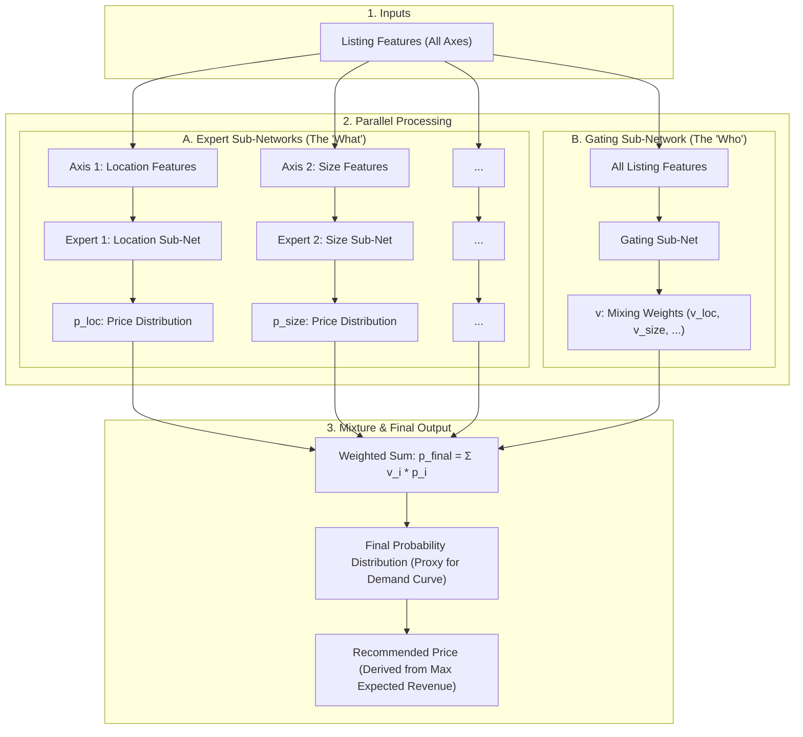

# Project Architecture Update: A Mixture of Experts (MoE) Model for Explainable Pricing

**To:** The Project Team
**From:** Project Lead
**Date:** October 10, 2025
**Subject:** Proposal for a new model architecture to resolve the trade-off between explainability and performance.

### 1. The Problem: A Recap of Our Modeling Journey

Over the past few days, we have successfully implemented and tested three different modeling architectures. Each has provided critical insights but has also revealed a fundamental challenge.

#### 1.1. Attempt 1: The Log-Additive Model
*   **Approach:** Predicted the `log(price)` as a sum of contributions from each of the five feature axes.
*   **Results:** Excellent predictive performance. Training was stable, and the model achieved a low validation error (RW-MSLE of ~0.16).
*   **Limitation:** The explanation is **multiplicative**, not additive. The final price is `exp(bias) * exp(p_loc) * ...`. This violates our core project requirement of providing a simple, additive dollar-based breakdown (e.g., "$100 + $50 + ...").

#### 1.2. Attempt 2: The Direct Dollar-Additive Model
*   **Approach:** Predicted the `price` directly as a sum of dollar contributions from each axis.
*   **Results:** The model structure perfectly matched our desired additive explanation.
*   **Limitation:** Poor predictive performance (Val RW-MSE of ~$43) and very high MAPE, especially for lower-priced listings. The model's training was dominated by the highly **skewed distribution** of the target price, forcing it to focus on high-priced outliers at the expense of the majority of listings.

#### 1.3. Attempt 3: The Hybrid Model
*   **Approach:** A more complex model with a "backbone" predicting `log(price)` for accuracy and additive "heads" trained to explain the final dollar price.
*   **Results:** The architecture was theoretically sound but failed in practice.
*   **Limitation:** Catastrophic training instability. The two competing loss functions (one on the log scale, one on the dollar scale) were on incompatible scales, causing the gradients from the dollar-based loss to overwhelm the training process.

### 2. The Core Dilemma

Our experiments have clearly shown that we face a fundamental trade-off between **explanatory structure** and **predictive performance**. The methods that yield the simple additive explanation we want are numerically unstable and inaccurate, while the method that is stable and accurate does not produce the explanation we need.

To move forward, we need a new architecture that is designed from the ground up to resolve this conflict.

### 3. The Solution: A Mixture of Experts (MoE) Architecture

I propose we pivot to a more sophisticated architecture known as a **Mixture of Experts (MoE)**. This model reframes the problem from simple regression to probabilistic classification, which elegantly solves our core dilemma.

The core analogy is to think of the model as a **team of specialist advisors** managed by a **foreman**.

#### 3.1. The Key Idea: From Regression to Probabilistic Classification

Instead of predicting a single price, we will predict a **probability distribution over a set of discrete price buckets**.

*   **Price Bucketing:** We will transform the continuous `target_price` into a categorical target. For example, we can define buckets of $10 increments, where bucket `0` = [$0, $10), bucket `1` = [$10, $20), and so on. Let `N` be the total number of price buckets.
*   **Benefit:** This completely eliminates the problem of a skewed target distribution. For a classification model, the numerical value of the labels is irrelevant, making training inherently stable. The output is a rich demand curve, not just a single point.

#### 3.2. Architecture Diagram

The diagram below illustrates how different feature sets are processed by specialized "expert" networks, whose outputs are then intelligently combined by a "gating" network to produce the final price recommendation.

#### 3.3. Detailed Component Breakdown

*   **1. Inputs & Feature Partitioning:**
    *   The model ingests the complete feature set for a listing.
    *   These features are then split. Let `M` be the number of feature axes (`M=5` in our case).
    *   Each of the `M` **Expert Sub-Networks** receives *only* the features relevant to its domain (e.g., the Location Expert only sees location-related features).
    *   The **Gating Sub-Network** receives *all* features, as it needs the full context to make a management decision.

*   **2. Expert Sub-Networks (The "What"):**
    *   Each of the `M=5` expert networks is a specialist. It learns the relationship between its features and the market price, independent of the others.
    *   Its output is a full probability distribution (`p_i`) over the `N` price buckets. This represents the "opinion" of that expert (e.g., `p_loc` shows the price distribution suggested by the location features alone).

*   **3. Gating Sub-Network (The "Who"):**
    *   The gating network acts as the foreman. It examines the entire listing and determines how trustworthy each expert's opinion is for this *specific* context.
    *   Its output is a vector of `M=5` mixing weights (`v`) that sum to 1 (via a softmax layer). These weights represent the importance or confidence assigned to each expert for the given listing.

*   **4. Mixture & Final Prediction:**
    *   The final probability distribution (`p_final`) is calculated as a weighted average of all the expert opinions: `p_final = v_loc * p_loc + v_size * p_size + ...`.
    *   This final distribution is a sophisticated, context-aware proxy for the listing's demand curve.
    *   The final **Recommended Price** is then derived by finding the price bucket in this distribution that maximizes the expected revenue (`Price × Probability`).

### 4. A Superior Form of Explainability

This model moves beyond a single, static breakdown to a dynamic, two-part explanation that is far more powerful and intuitive.

#### 4.1. Part 1: Dynamic Feature Importance (The Gating Weights `v`)
The model first tells the user *what features mattered most* for their specific listing.

> *"For your penthouse apartment, we calculate that **Amenities are the most important factor (65% importance)**, followed by Location (25%). For this listing, the quality of reviews was less important (10%)."*

#### 4.2. Part 2: Competing Expert Opinions (The Expert Distributions `p_i`)
The model then shows the user the "opinions" of the key experts, revealing the trade-offs in their property.

> *"Viewed alone, your prime **Location suggested a price around $500/night**. However, your sparse **Amenities suggested a price closer to $220/night**. Our final recommendation balances these competing factors based on their learned importance."*

### 5. Summary of Advantages

This MoE architecture represents a significant step forward and is a strong candidate for our final model:
1.  **Solves Training Instability:** By shifting to classification, it completely resolves the numerical stability and performance issues caused by the skewed price data.
2.  **Delivers a Richer Explanation:** The two-part explanation is more intuitive, defensible, and transparent than a simple additive list.
3.  **Directly Models Market Uncertainty:** The output is a demand curve, which is a more realistic and useful representation of market dynamics than a single price point.
4.  **Represents a More Advanced System:** This is a modern, sophisticated architecture that will be a more impressive component of our final portfolio project. be a more impressive component of our final portfolio project.