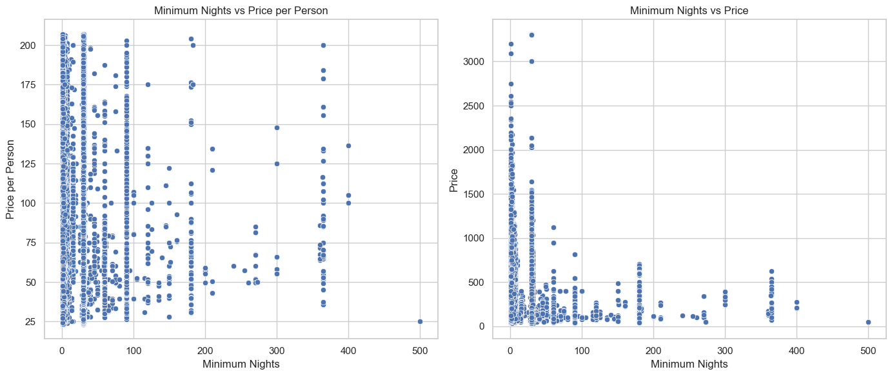

# Airbnb NYC Data Pre-processing & ETL

This notebook implements the end-to-end data pipeline to create the final modeling dataset from raw InsideAirbnb snapshots.

**Objective:** Load all monthly listings snapshots and the full reviews history, clean features, engineer the `estimated_occupancy_rate` sample weight, and produce a single, model-ready `listing-month` panel.

### 0. Setup & Data Loading


```python
import pandas as pd
import numpy as np
import os
import glob

# --- Configuration ---
# Parent directory containing the 'listings-YY-MM.csv' files and '{CITY}-reviews-detailed...csv'
CITY = "nyc"
INPUT_DATA_DIR = os.path.expanduser(f"~/Downloads/insideairbnb/{CITY}") 
OUTPUT_DATA_DIR = os.path.expanduser(f"../data/{CITY}")
OUTPUT_FILENAME = f"{CITY}_dataset_oct_20.parquet"

# Configure pandas display
pd.options.display.max_columns = 100

# --- Load All Monthly Listings Snapshots ---
listings_files = sorted(glob.glob(os.path.join(INPUT_DATA_DIR, 'listings-*.csv')))
if not listings_files:
    raise FileNotFoundError(f"No 'listings-*.csv' files found in {INPUT_DATA_DIR}")

print(f"Found {len(listings_files)} monthly listings files. Loading and concatenating...")

dfs = []
for file in listings_files:
    # low_memory=False handles mixed data types in raw CSVs
    df = pd.read_csv(file, low_memory=False) 
    dfs.append(df)

raw_listings_df = pd.concat(dfs, ignore_index=True)
print(f"Successfully loaded {len(raw_listings_df):,} total listing records.")

# --- Load Full Reviews History ---
reviews_path = os.path.join(INPUT_DATA_DIR, f'{CITY}-reviews-detailed-insideairbnb.csv')
print(f"Loading reviews from: {os.path.basename(reviews_path)}...")
try:
    raw_reviews_df = pd.read_csv(reviews_path)
    print(f"Successfully loaded {len(raw_reviews_df):,} reviews.")
except FileNotFoundError:
    raise FileNotFoundError(f"Could not find reviews file at: {reviews_path}")

# Display samples
print("\nListings Sample:")
display(raw_listings_df.head(2))
print("\nReviews Sample:")
display(raw_reviews_df.head(2))

# Display column info
print("\nListings DataFrame Info:")
print(raw_listings_df.info())
print("\nReviews DataFrame Info:")
print(raw_reviews_df.info())
```

    Found 12 monthly listings files. Loading and concatenating...
    Successfully loaded 443,898 total listing records.
    Loading reviews from: nyc-reviews-detailed-insideairbnb.csv...
    Successfully loaded 986,597 reviews.

    Listings DataFrame Info:
    <class 'pandas.core.frame.DataFrame'>
    RangeIndex: 443898 entries, 0 to 443897
    Data columns (total 79 columns):
     #   Column                                        Non-Null Count   Dtype  
    ---  ------                                        --------------   -----  
     0   id                                            443898 non-null  int64  
     1   listing_url                                   443898 non-null  object 
     2   scrape_id                                     443898 non-null  int64  
     3   last_scraped                                  443898 non-null  object 
     4   source                                        443898 non-null  object 
     5   name                                          443874 non-null  object 
     6   description                                   432027 non-null  object 
     7   neighborhood_overview                         236590 non-null  object 
     8   picture_url                                   443891 non-null  object 
     9   host_id                                       443898 non-null  int64  
     10  host_url                                      443898 non-null  object 
     11  host_name                                     441463 non-null  object 
     12  host_since                                    441460 non-null  object 
     13  host_location                                 348943 non-null  object 
     14  host_about                                    252528 non-null  object 
     15  host_response_time                            259303 non-null  object 
     16  host_response_rate                            259303 non-null  object 
     17  host_acceptance_rate                          265377 non-null  object 
     18  host_is_superhost                             438729 non-null  object 
     19  host_thumbnail_url                            441460 non-null  object 
     20  host_picture_url                              441460 non-null  object 
     21  host_neighbourhood                            352281 non-null  object 
     22  host_listings_count                           441460 non-null  float64
     23  host_total_listings_count                     441460 non-null  float64
     24  host_verifications                            441460 non-null  object 
     25  host_has_profile_pic                          441460 non-null  object 
     26  host_identity_verified                        441460 non-null  object 
     27  neighbourhood                                 236602 non-null  object 
     28  neighbourhood_cleansed                        443898 non-null  object 
     29  neighbourhood_group_cleansed                  443898 non-null  object 
     30  latitude                                      443898 non-null  float64
     31  longitude                                     443898 non-null  float64
     32  property_type                                 443898 non-null  object 
     33  room_type                                     443898 non-null  object 
     34  accommodates                                  443898 non-null  int64  
     35  bathrooms                                     267049 non-null  float64
     36  bathrooms_text                                443238 non-null  object 
     37  bedrooms                                      372494 non-null  float64
     38  beds                                          265841 non-null  float64
     39  amenities                                     443898 non-null  object 
     40  price                                         265091 non-null  object 
     41  minimum_nights                                443898 non-null  int64  
     42  maximum_nights                                443898 non-null  int64  
     43  minimum_minimum_nights                        443819 non-null  float64
     44  maximum_minimum_nights                        443819 non-null  float64
     45  minimum_maximum_nights                        443819 non-null  float64
     46  maximum_maximum_nights                        443819 non-null  float64
     47  minimum_nights_avg_ntm                        443839 non-null  float64
     48  maximum_nights_avg_ntm                        443839 non-null  float64
     49  calendar_updated                              0 non-null       float64
     50  has_availability                              377507 non-null  object 
     51  availability_30                               443898 non-null  int64  
     52  availability_60                               443898 non-null  int64  
     53  availability_90                               443898 non-null  int64  
     54  availability_365                              443898 non-null  int64  
     55  calendar_last_scraped                         443898 non-null  object 
     56  number_of_reviews                             443898 non-null  int64  
     57  number_of_reviews_ltm                         443898 non-null  int64  
     58  number_of_reviews_l30d                        443898 non-null  int64  
     59  first_review                                  305391 non-null  object 
     60  last_review                                   305391 non-null  object 
     61  review_scores_rating                          305391 non-null  float64
     62  review_scores_accuracy                        305244 non-null  float64
     63  review_scores_cleanliness                     305357 non-null  float64
     64  review_scores_checkin                         305196 non-null  float64
     65  review_scores_communication                   305297 non-null  float64
     66  review_scores_location                        305161 non-null  float64
     67  review_scores_value                           305172 non-null  float64
     68  license                                       64550 non-null   object 
     69  instant_bookable                              443898 non-null  object 
     70  calculated_host_listings_count                443898 non-null  int64  
     71  calculated_host_listings_count_entire_homes   443898 non-null  int64  
     72  calculated_host_listings_count_private_rooms  443898 non-null  int64  
     73  calculated_host_listings_count_shared_rooms   443898 non-null  int64  
     74  reviews_per_month                             305391 non-null  float64
     75  availability_eoy                              330758 non-null  float64
     76  number_of_reviews_ly                          330758 non-null  float64
     77  estimated_occupancy_l365d                     330758 non-null  float64
     78  estimated_revenue_l365d                       195996 non-null  float64
    dtypes: float64(26), int64(17), object(36)
    memory usage: 267.5+ MB
    None
    
    Reviews DataFrame Info:
    <class 'pandas.core.frame.DataFrame'>
    RangeIndex: 986597 entries, 0 to 986596
    Data columns (total 6 columns):
     #   Column         Non-Null Count   Dtype 
    ---  ------         --------------   ----- 
     0   listing_id     986597 non-null  int64 
     1   id             986597 non-null  int64 
     2   date           986597 non-null  object
     3   reviewer_id    986597 non-null  int64 
     4   reviewer_name  986594 non-null  object
     5   comments       986338 non-null  object
    dtypes: int64(3), object(3)
    memory usage: 45.2+ MB
    None


### 1. Remove unnecessary columns


```python
cols_to_keep = [
    'id',
    'host_id',
    'name',
    'description',
    'host_is_superhost',
    'neighbourhood_cleansed',
    'latitude',
    'longitude',
    'property_type',
    'room_type',
    'accommodates',
    'bathrooms',
    'bedrooms',
    'beds',
    'amenities',
    'minimum_nights',
    'review_scores_rating',  #float
    'review_scores_accuracy',  #float
    'review_scores_cleanliness',  #float
    'review_scores_checkin',  #float
    'review_scores_communication',  #float
    'review_scores_location',  #float
    'review_scores_value',  #float
    'last_scraped',
    'price'
    ]

listings_df = raw_listings_df[cols_to_keep].copy()
print(f"\nReduced listings DataFrame to {len(listings_df.columns)} columns.")
print(listings_df.info())
```

    Reduced listings DataFrame to 25 columns.
    <class 'pandas.core.frame.DataFrame'>
    RangeIndex: 443898 entries, 0 to 443897
    Data columns (total 25 columns):
     #   Column                       Non-Null Count   Dtype  
    ---  ------                       --------------   -----  
     0   id                           443898 non-null  int64  
     1   host_id                      443898 non-null  int64  
     2   name                         443874 non-null  object 
     3   description                  432027 non-null  object 
     4   host_is_superhost            438729 non-null  object 
     5   neighbourhood_cleansed       443898 non-null  object 
     6   latitude                     443898 non-null  float64
     7   longitude                    443898 non-null  float64
     8   property_type                443898 non-null  object 
     9   room_type                    443898 non-null  object 
     10  accommodates                 443898 non-null  int64  
     11  bathrooms                    267049 non-null  float64
     12  bedrooms                     372494 non-null  float64
     13  beds                         265841 non-null  float64
     14  amenities                    443898 non-null  object 
     15  minimum_nights               443898 non-null  int64  
     16  review_scores_rating         305391 non-null  float64
     17  review_scores_accuracy       305244 non-null  float64
     18  review_scores_cleanliness    305357 non-null  float64
     19  review_scores_checkin        305196 non-null  float64
     20  review_scores_communication  305297 non-null  float64
     21  review_scores_location       305161 non-null  float64
     22  review_scores_value          305172 non-null  float64
     23  last_scraped                 443898 non-null  object 
     24  price                        265091 non-null  object 
    dtypes: float64(12), int64(4), object(9)
    memory usage: 84.7+ MB
    None
    <class 'pandas.core.frame.DataFrame'>
    RangeIndex: 443898 entries, 0 to 443897
    Data columns (total 25 columns):
     #   Column                       Non-Null Count   Dtype  
    ---  ------                       --------------   -----  
     0   id                           443898 non-null  int64  
     1   host_id                      443898 non-null  int64  
     2   name                         443874 non-null  object 
     3   description                  432027 non-null  object 
     4   host_is_superhost            438729 non-null  object 
     5   neighbourhood_cleansed       443898 non-null  object 
     6   latitude                     443898 non-null  float64
     7   longitude                    443898 non-null  float64
     8   property_type                443898 non-null  object 
     9   room_type                    443898 non-null  object 
     10  accommodates                 443898 non-null  int64  
     11  bathrooms                    267049 non-null  float64
     12  bedrooms                     372494 non-null  float64
     13  beds                         265841 non-null  float64
     14  amenities                    443898 non-null  object 
     15  minimum_nights               443898 non-null  int64  
     16  review_scores_rating         305391 non-null  float64
     17  review_scores_accuracy       305244 non-null  float64
     18  review_scores_cleanliness    305357 non-null  float64
     19  review_scores_checkin        305196 non-null  float64
     20  review_scores_communication  305297 non-null  float64
     21  review_scores_location       305161 non-null  float64
     22  review_scores_value          305172 non-null  float64
     23  last_scraped                 443898 non-null  object 
     24  price                        265091 non-null  object 
    dtypes: float64(12), int64(4), object(9)
    memory usage: 84.7+ MB
    None


### 2. Convert the scrape-date to month (1-12), convert `host_is_superhost` col to numeric 0/1


```python
# Convert last_scraped to datetime
raw_listings_df['last_scraped'] = pd.to_datetime(raw_listings_df['last_scraped'], errors='coerce')

# Convert last_scraped to month only (no year)
listings_df['month'] = raw_listings_df['last_scraped'].dt.month

# Drop the last_scraped column as it's no longer needed
listings_df = listings_df.drop(columns=['last_scraped'])
```

### 3. Clean price column, drop outliers, add price-per-person and log1p of both


```python
# Convert prices to float
listings_df['price'] = listings_df['price'].replace(r'[\$,]', '', regex=True).astype(float)

# Drop NaN's from price column and make it float
listings_df = listings_df.dropna(subset=['price'])

# Add price_per_person column
listings_df['price_per_person'] = listings_df['price'] / listings_df['accommodates']

# Drop the bottom 5% and top 5% of price_per_person to remove outliers
lower_bound = listings_df['price_per_person'].quantile(0.05)
upper_bound = listings_df['price_per_person'].quantile(0.95)
listings_df = listings_df[(listings_df['price_per_person'] >= lower_bound) & (listings_df['price_per_person'] <= upper_bound)]

# Add log1p transformed columns
listings_df['log_price'] = np.log1p(listings_df['price'])
listings_df['log_price_per_person'] = np.log1p(listings_df['price_per_person'])

# Print info and a sample
print("\nUpdated Listings DataFrame Info:")
print(listings_df.info())
print("\nListings DataFrame Sample with New Columns:")
display(listings_df.head(5))
```

    
    Updated Listings DataFrame Info:
    <class 'pandas.core.frame.DataFrame'>
    Index: 238598 entries, 1 to 443897
    Data columns (total 28 columns):
     #   Column                       Non-Null Count   Dtype  
    ---  ------                       --------------   -----  
     0   id                           238598 non-null  int64  
     1   host_id                      238598 non-null  int64  
     2   name                         238598 non-null  object 
     3   description                  234290 non-null  object 
     4   host_is_superhost            234720 non-null  object 
     5   neighbourhood_cleansed       238598 non-null  object 
     6   latitude                     238598 non-null  float64
     7   longitude                    238598 non-null  float64
     8   property_type                238598 non-null  object 
     9   room_type                    238598 non-null  object 
     10  accommodates                 238598 non-null  int64  
     11  bathrooms                    238523 non-null  float64
     12  bedrooms                     237843 non-null  float64
     13  beds                         237768 non-null  float64
     14  amenities                    238598 non-null  object 
     15  minimum_nights               238598 non-null  int64  
     16  review_scores_rating         170700 non-null  float64
     17  review_scores_accuracy       170682 non-null  float64
     18  review_scores_cleanliness    170682 non-null  float64
     19  review_scores_checkin        170682 non-null  float64
     20  review_scores_communication  170682 non-null  float64
     21  review_scores_location       170673 non-null  float64
     22  review_scores_value          170682 non-null  float64
     23  price                        238598 non-null  float64
     24  month                        238598 non-null  int32  
     25  price_per_person             238598 non-null  float64
     26  log_price                    238598 non-null  float64
     27  log_price_per_person         238598 non-null  float64
    dtypes: float64(16), int32(1), int64(4), object(7)
    memory usage: 51.9+ MB
    None
    
    Listings DataFrame Sample with New Columns:

```python
listings_df['month'].value_counts()
```

    month
    12    20975
    2     20863
    1     20856
    11    20745
    3     20152
    4     19900
    5     19729
    7     19285
    6     19231
    8     19164
    10    19009
    9     18689
    Name: count, dtype: int64


### 4. Keep only listings with at least one review, drop rows with NaN's, keep only listings that appear in at least 8 months (unless the data is quarterly)


```python
# Compare IDs between listings_df and raw_reviews_df
listings_ids = set(listings_df['id'].unique())
reviews_ids = set(raw_reviews_df['listing_id'].unique())

common_ids = listings_ids & reviews_ids
only_in_listings = listings_ids - reviews_ids
only_in_reviews = reviews_ids - listings_ids

print(f"Total unique IDs in listings: {len(listings_ids)}")
print(f"Total unique IDs in reviews: {len(reviews_ids)}")
print(f"Common IDs: {len(common_ids)}")
print(f"IDs only in listings: {len(only_in_listings)}")
print(f"IDs only in reviews: {len(only_in_reviews)}")

# Optionally, display some samples
print("\nSample common IDs:", list(common_ids)[:5])
print("Sample only in listings:", list(only_in_listings)[:5])
print("Sample only in reviews:", list(only_in_reviews)[:5])

# Keep only common IDs in listings and reviews
common_listings_df = listings_df[listings_df['id'].isin(common_ids)]
common_reviews_df = raw_reviews_df[raw_reviews_df['listing_id'].isin(common_ids)]

# Drop all listings with NaN's
common_listings_df = common_listings_df.dropna()

# Keep only listings that appear at least 8 times (unless data is quarterly)
if listings_df['month'].nunique() > 4:
    common_listings_df = common_listings_df[common_listings_df.groupby('id')['id'].transform('size') >= 8]

# Display info after filtering
print("\nFiltered Listings DataFrame Info:")
print(common_listings_df.info())
print("\nFiltered Reviews DataFrame Info:")
print(common_reviews_df.info())
```

    Total unique IDs in listings: 31849
    Total unique IDs in reviews: 24923
    Common IDs: 16526
    IDs only in listings: 15323
    IDs only in reviews: 8397
    
    Sample common IDs: [np.int64(48758785), np.int64(1194458269999890435), np.int64(847115675515322373), np.int64(819206), np.int64(2949128)]
    Sample only in listings: [np.int64(681805560172871680), np.int64(649151763894140930), np.int64(1472518013221634050), np.int64(43679750), np.int64(1164495582863458314)]
    Sample only in reviews: [np.int64(1277955), np.int64(952770872245256198), np.int64(491529), np.int64(14155795), np.int64(2261018)]
    
    Filtered Listings DataFrame Info:
    <class 'pandas.core.frame.DataFrame'>
    Index: 127661 entries, 1 to 440988
    Data columns (total 28 columns):
     #   Column                       Non-Null Count   Dtype  
    ---  ------                       --------------   -----  
     0   id                           127661 non-null  int64  
     1   host_id                      127661 non-null  int64  
     2   name                         127661 non-null  object 
     3   description                  127661 non-null  object 
     4   host_is_superhost            127661 non-null  object 
     5   neighbourhood_cleansed       127661 non-null  object 
     6   latitude                     127661 non-null  float64
     7   longitude                    127661 non-null  float64
     8   property_type                127661 non-null  object 
     9   room_type                    127661 non-null  object 
     10  accommodates                 127661 non-null  int64  
     11  bathrooms                    127661 non-null  float64
     12  bedrooms                     127661 non-null  float64
     13  beds                         127661 non-null  float64
     14  amenities                    127661 non-null  object 
     15  minimum_nights               127661 non-null  int64  
     16  review_scores_rating         127661 non-null  float64
     17  review_scores_accuracy       127661 non-null  float64
     18  review_scores_cleanliness    127661 non-null  float64
     19  review_scores_checkin        127661 non-null  float64
     20  review_scores_communication  127661 non-null  float64
     21  review_scores_location       127661 non-null  float64
     22  review_scores_value          127661 non-null  float64
     23  price                        127661 non-null  float64
     24  month                        127661 non-null  int32  
     25  price_per_person             127661 non-null  float64
     26  log_price                    127661 non-null  float64
     27  log_price_per_person         127661 non-null  float64
    dtypes: float64(16), int32(1), int64(4), object(7)
    memory usage: 27.8+ MB
    None
    
    Filtered Reviews DataFrame Info:
    <class 'pandas.core.frame.DataFrame'>
    Index: 833794 entries, 47 to 986596
    Data columns (total 6 columns):
     #   Column         Non-Null Count   Dtype 
    ---  ------         --------------   ----- 
     0   listing_id     833794 non-null  int64 
     1   id             833794 non-null  int64 
     2   date           833794 non-null  object
     3   reviewer_id    833794 non-null  int64 
     4   reviewer_name  833793 non-null  object
     5   comments       833573 non-null  object
    dtypes: int64(3), object(3)
    memory usage: 44.5+ MB
    None
    <class 'pandas.core.frame.DataFrame'>
    Index: 833794 entries, 47 to 986596
    Data columns (total 6 columns):
     #   Column         Non-Null Count   Dtype 
    ---  ------         --------------   ----- 
     0   listing_id     833794 non-null  int64 
     1   id             833794 non-null  int64 
     2   date           833794 non-null  object
     3   reviewer_id    833794 non-null  int64 
     4   reviewer_name  833793 non-null  object
     5   comments       833573 non-null  object
    dtypes: int64(3), object(3)
    memory usage: 44.5+ MB
    None


### 5. Add column with total reviews extracted from `common_reviews_df`, format `host_is_superhost`, `bedrooms`, and `beds` columns 


```python
# Aggregate reviews to get total reviews per listing
reviews_count = common_reviews_df.groupby('listing_id').size().reset_index(name='total_reviews')

# Merge on the listing ID
final_df = common_listings_df.merge(reviews_count, left_on='id', right_on='listing_id', how='left')

# Convert total_reviews to int
final_df['total_reviews'] = final_df['total_reviews'].astype('int')

# Drop the redundant listing_id column
final_df = final_df.drop(columns=['listing_id'])

# Convert host_is_superhost to numeric 0/1
final_df['host_is_superhost'] = final_df['host_is_superhost'].astype(str).map({'t': 1, 'f': 0})

# Convert bedrooms and beds to int
final_df['bedrooms'] = final_df['bedrooms'].astype('int')
final_df['beds'] = final_df['beds'].astype('int')

# Print information about the final DataFrame
print(f"\nFinal listings dataset for {CITY}:")
display(final_df.info())

# Display 3 sample listings (all occurrences)
sample_ids = np.random.choice(final_df['id'].unique(), size=3, replace=False)
for listing_id in sample_ids:
    listing_reviews = final_df[final_df['id'] == listing_id]
    print(f"\nSample data for listing ID {listing_id}:")
    display(listing_reviews)
```

    
    Final listings dataset for nyc:
    <class 'pandas.core.frame.DataFrame'>
    RangeIndex: 127661 entries, 0 to 127660
    Data columns (total 29 columns):
     #   Column                       Non-Null Count   Dtype  
    ---  ------                       --------------   -----  
     0   id                           127661 non-null  int64  
     1   host_id                      127661 non-null  int64  
     2   name                         127661 non-null  object 
     3   description                  127661 non-null  object 
     4   host_is_superhost            127661 non-null  int64  
     5   neighbourhood_cleansed       127661 non-null  object 
     6   latitude                     127661 non-null  float64
     7   longitude                    127661 non-null  float64
     8   property_type                127661 non-null  object 
     9   room_type                    127661 non-null  object 
     10  accommodates                 127661 non-null  int64  
     11  bathrooms                    127661 non-null  float64
     12  bedrooms                     127661 non-null  int64  
     13  beds                         127661 non-null  int64  
     14  amenities                    127661 non-null  object 
     15  minimum_nights               127661 non-null  int64  
     16  review_scores_rating         127661 non-null  float64
     17  review_scores_accuracy       127661 non-null  float64
     18  review_scores_cleanliness    127661 non-null  float64
     19  review_scores_checkin        127661 non-null  float64
     20  review_scores_communication  127661 non-null  float64
     21  review_scores_location       127661 non-null  float64
     22  review_scores_value          127661 non-null  float64
     23  price                        127661 non-null  float64
     24  month                        127661 non-null  int32  
     25  price_per_person             127661 non-null  float64
     26  log_price                    127661 non-null  float64
     27  log_price_per_person         127661 non-null  float64
     28  total_reviews                127661 non-null  int64  
    dtypes: float64(14), int32(1), int64(8), object(6)
    memory usage: 27.8+ MB

### 6. Clean up amenities


```python
import ast
import re

# --- 1. Helper functions ---
def clean_and_format_amenities(amenities_str: str) -> str:
    """
    Safely parses a stringified list of amenities and returns
    a single, comma-separated string suitable for a sentence transformer.

    Args:
        amenities_str: The raw string from the 'amenities' column.

    Returns:
        A clean, comma-separated string of amenities, or an empty string
        if the input is invalid or empty.
    """
    if not isinstance(amenities_str, str) or amenities_str in ('', '[]'):
        return ""
    
    try:
        # ast.literal_eval is the safest way to parse a string
        # that should contain a Python literal (like a list).
        amenities_list = ast.literal_eval(amenities_str)

        # convert to lowercase
        amenities_list = [amenity.lower() for amenity in amenities_list]
        
        # Ensure it's actually a list before trying to join
        if isinstance(amenities_list, list):
            # Join the list elements into a single, clean string
            return ", ".join(sorted(amenities_list))
        else:
            return ""
            
    except (ValueError, SyntaxError):
        # This catches malformed strings that ast cannot parse
        return ""

def sanitize_string(text: str) -> str:
    if not isinstance(text, str):
        return ""
    # Remove surrogate characters and other unusual Unicode
    text = re.sub(r'[\ud800-\udfff]', '', text)  # Surrogates
    text = re.sub(r'[^\x00-\x7F]+', '', text)  # Non-ASCII characters
    text = re.sub(r'<.*?>', ' ', text).replace('\n', ' ').strip() # HTML tags
    return text


# --- 3. Apply the function and verify the result ---

print("\n--- Before Formatting ---")
print(final_df[['amenities']].head())
print(f"\nOriginal dtype: {final_df['amenities'].dtype}")


# Apply the cleaning functions to the 'amenities' and 'description' columns
final_df['amenities'] = final_df['amenities'].apply(clean_and_format_amenities)
final_df['amenities'] = final_df['amenities'].apply(sanitize_string)
final_df['description'] = final_df['description'].apply(sanitize_string)

# Print the number of rows with empty description, and number of rows with empty amenities
empty_description_count = (final_df['description'] == '').sum()
empty_amenities_count = (final_df['amenities'] == '').sum()
print(f"Number of rows with empty description: {empty_description_count}")
print(f"Number of rows with empty amenities: {empty_amenities_count}")

# Drop rows with empty amenities or empty description
final_df = final_df[(final_df['amenities'] != '') & (final_df['description'] != '')]

print("\n\n--- After Formatting ---")
print(final_df[['amenities']].head())
print(f"\nNew dtype: {final_df['amenities'].dtype}")

# print examples of 3 fully formatted amenities and description strings 
sample_ids = np.random.choice(final_df['id'].unique(), size=3, replace=False)
for listing_id in sample_ids:
    listing_data = final_df[final_df['id'] == listing_id].iloc[0]
    print(f"\nSample data for listing ID {listing_id}:")
    print(f"Amenities: '{listing_data['amenities']}'")
    print(f"Description: '{listing_data['description']}'")
```

    
    --- Before Formatting ---
                                               amenities
    0  ["Fire extinguisher", "Smoke alarm", "Stove", ...
    1  ["Heating", "Washer", "Fire extinguisher", "Sm...
    2  ["Fire extinguisher", "Smoke alarm", "Stove", ...
    3  ["Fire extinguisher", "Smoke alarm", "Private ...
    4  ["Fire extinguisher", "Board games", "Smoke al...
    
    Original dtype: object
    Number of rows with empty description: 12
    Number of rows with empty amenities: 59
    
    
    --- After Formatting ---
                                               amenities
    0  air conditioning, bed linens, carbon monoxide ...
    1  carbon monoxide alarm, dryer, elevator, essent...
    2  air conditioning, breakfast, carbon monoxide a...
    3  48 inch hdtv with roku, standard cable, bed li...
    4  156 inch hdtv with amazon prime video, apple t...
    
    New dtype: object
    
    Sample data for listing ID 6018589:
    Amenities: 'air conditioning, bed linens, carbon monoxide alarm, coffee maker, dryer, elevator, essentials, extra pillows and blankets, hangers, heating, hot water, kitchen, lock on bedroom door, microwave, oven, refrigerator, smoke alarm, stove, tv, washer, wifi'
    Description: 'Large bedroom right at the front of the apartment, Washington Heights, NY.'
    
    Sample data for listing ID 17123646:
    Amenities: 'air conditioning, bed linens, carbon monoxide alarm, cooking basics, dishes and silverware, essentials, fire extinguisher, first aid kit, free street parking, hair dryer, hangers, heating, hot water, kitchen, lockbox, long term stays allowed, microwave, mosquito net, oven, paid parking off premises, private living room, refrigerator, self check-in, shampoo, smoke alarm, stove, tv with standard cable, wifi'
    Description: 'Hi there! Whether you are a tourist visiting NYC or a young professional dreaming to conquer the city - the room can be perfect for you. Located 10 min walk away from subway 9 ave (D train) and 15 min from 36 street (N, D, R trains). 40 min by train to Bryant Park, Times Square, Columbus Circle and Central Park! 40 min to Coney Island and famous Brooklyn Boardwalk.  Numerous cafes, bars, restaurants, delis and groceries are around the corner.'
    
    Sample data for listing ID 757277022393109416:
    Amenities: 'air conditioning, bed linens, carbon monoxide alarm, elevator, essentials, exterior security cameras on property, hangers, heating, hot water, iron, kitchen, paid dryer  in building, pets allowed, private entrance, smoke alarm, trash compactor, tv, washer, wifi'
    Description: 'Located on Hells Kitchen: This elevator building has an on-site management and furnished roof deck. The building located in one of the most convenient neighborhoods in all of Manhattan. Midtown West/Hells Kitchen is a quiet residential neighborhood but is close to everything Manhattan has to offer. Times Square, Columbus Circle, Central Park and the Theater District are all within a short walk.You'll have a great time at this comfortable place to stay.'


```python
import matplotlib.pyplot as plt
import seaborn as sns

# Set up the plotting style
sns.set(style="whitegrid")

# Create a figure with two subplots
fig, axes = plt.subplots(1, 2, figsize=(14, 6))

# Scatterplot for minimum_nights vs price_per_person
sns.scatterplot(data=final_df, x='minimum_nights', y='price_per_person', ax=axes[0])
axes[0].set_title('Minimum Nights vs Price per Person')
axes[0].set_xlabel('Minimum Nights')
axes[0].set_ylabel('Price per Person')

# Scatterplot for minimum_nights vs price
sns.scatterplot(data=final_df, x='minimum_nights', y='price', ax=axes[1])
axes[1].set_title('Minimum Nights vs Price')
axes[1].set_xlabel('Minimum Nights')
axes[1].set_ylabel('Price')

# Adjust layout and show the plots
plt.tight_layout()
plt.show()
```


    

    


```python
import matplotlib.pyplot as plt
import seaborn as sns

# Set up the plotting style
sns.set(style="whitegrid")

# Create a figure with four subplots (2x2 grid)
fig, axes = plt.subplots(2, 2, figsize=(14, 10))

# Histogram for price
sns.histplot(data=final_df, x='price', ax=axes[0, 0], bins=50, kde=True)
axes[0, 0].set_title('Histogram of Price')
axes[0, 0].set_xlabel('Price')
axes[0, 0].set_ylabel('Frequency')

# Histogram for price_per_person
sns.histplot(data=final_df, x='price_per_person', ax=axes[0, 1], bins=50, kde=True)
axes[0, 1].set_title('Histogram of Price per Person')
axes[0, 1].set_xlabel('Price per Person')
axes[0, 1].set_ylabel('Frequency')

# Histogram for log_price
sns.histplot(data=final_df, x='log_price', ax=axes[1, 0], bins=50, kde=True)
axes[1, 0].set_title('Histogram of Log Price')
axes[1, 0].set_xlabel('Log Price')
axes[1, 0].set_ylabel('Frequency')

# Histogram for log_price_per_person
sns.histplot(data=final_df, x='log_price_per_person', ax=axes[1, 1], bins=50, kde=True)
axes[1, 1].set_title('Histogram of Log Price per Person')
axes[1, 1].set_xlabel('Log Price per Person')
axes[1, 1].set_ylabel('Frequency')

# Adjust layout and show the plots
plt.tight_layout()
plt.show()
```


    

    


```python
# paste into your notebook
import numpy as np
import scipy.stats as stats

cols = ['price', 'price_per_person', 'log_price', 'log_price_per_person']
for c in cols:
    vals = final_df[c].dropna().values
    skew = stats.skew(vals)
    kurt = stats.kurtosis(vals)   # Fisher (0 for normal)
    shapiro_p = stats.shapiro(vals[:5000])[1] if len(vals)>3 else np.nan  # sample-limited
    print(f"{c}: skew={skew:.3f}, kurtosis={kurt:.3f}, shapiro_p≈{shapiro_p:.3g}")
```

    price: skew=4.719, kurtosis=49.144, shapiro_p≈1.76e-72
    price_per_person: skew=1.338, kurtosis=1.691, shapiro_p≈3.61e-52
    log_price: skew=0.337, kurtosis=0.296, shapiro_p≈1.78e-17
    log_price_per_person: skew=0.281, kurtosis=-0.501, shapiro_p≈1.93e-24


### 8. Finalize & Save Modeling Dataset


```python
import re

def check_sanitization(df, columns_to_check):
    """
    Checks if the specified columns in the DataFrame are suitably sanitized.
    Reports any remaining HTML tags, surrogates, or non-ASCII characters.
    """
    issues_found = False
    
    for col in columns_to_check:
        if col not in df.columns:
            print(f"Column '{col}' not found in DataFrame.")
            continue
        
        print(f"\nChecking column: '{col}'")
        
        # Check for HTML tags
        html_mask = df[col].astype(str).str.contains(r'<.*?>', regex=True)
        if html_mask.any():
            issues_found = True
            print(f"  - Found HTML tags in {html_mask.sum()} rows.")
        
        # Check for surrogates
        surrogate_mask = df[col].astype(str).str.contains(r'[\ud800-\udfff]', regex=True)
        if surrogate_mask.any():
            issues_found = True
            print(f"  - Found surrogate characters in {surrogate_mask.sum()} rows.")
        
        # Check for non-ASCII characters (optional, as per previous cleaning)
        non_ascii_mask = df[col].astype(str).str.contains(r'[^\x00-\x7F]', regex=True)
        if non_ascii_mask.any():
            issues_found = True
            print(f"  - Found non-ASCII characters in {non_ascii_mask.sum()} rows.")
        
        if not (html_mask.any() or surrogate_mask.any() or non_ascii_mask.any()):
            print("  - Column appears sanitized.")
    
    if not issues_found:
        print("\nAll specified columns are suitably sanitized.")
    else:
        print("\nIssues found in sanitization.")

# Usage: Check 'description' and 'amenities' columns
check_sanitization(final_df, ['description', 'amenities'])
```

    
    Checking column: 'description'
      - Column appears sanitized.
    
    Checking column: 'amenities'
      - Column appears sanitized.
    
    All specified columns are suitably sanitized.


```python
# Save to Parquet
output_path = os.path.join(OUTPUT_DATA_DIR, OUTPUT_FILENAME)
print(f"\nSaving to {output_path}...")
final_df.to_parquet(output_path, index=False)
print("Done.")
```

    
    Saving to ../data/nyc/nyc_dataset_oct_20.parquet...
    Done.


```python
# Save a sample with all occurrences of 2 random listings
sample_ids = np.random.choice(final_df['id'].unique(), size=2, replace=False)
sample_df = final_df[final_df['id'].isin(sample_ids)]
sample_output_path = os.path.join(OUTPUT_DATA_DIR, f"{CITY}_sample_listings_oct_20.csv")
sample_df.to_csv(sample_output_path, index=False)
print(f"Sample listings saved to {sample_output_path}.")
```

    Sample listings saved to ../data/nyc/nyc_sample_listings_oct_20.csv.


```python

```
